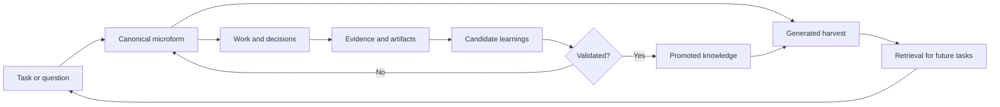

# Microforms

Microforms is a provenance-first repository for turning work into durable, reusable knowledge.

A **microform** is the smallest self-contained unit that records a bounded task, the context in which it was performed, the evidence produced, the resulting artifacts, and the learnings that may be useful again.

The governing rule is:

> No durable learning exists without provenance to the work that produced it.

## System model



The architecture has four distinct layers:

1. **Capture** - canonical microforms record work and provenance.
2. **Validation** - schemas and tests enforce repository invariants.
3. **Harvesting** - generated indexes make units searchable and machine-readable.
4. **Promotion** - reviewed learnings become durable decisions, patterns, or playbooks.

Do not collapse these layers. A generated index is not a source of truth, and an extracted learning is not validated knowledge.

## Repository structure

```text
microforms/
|-- README.md
|-- AGENTS.md
|-- .gitignore
|-- .agents/
|   `-- skills/
|-- schemas/
|   |-- microform.schema.json
|   `-- knowledge.schema.json
|-- templates/
|   |-- microform.md
|   `-- knowledge.md
|-- microforms/
|   `-- YYYY/
|       `-- MM/
|           `-- <uuidv7>-<slug>/
|               |-- microform.md
|               |-- sources/
|               |-- evidence/
|               `-- artifacts/
|-- knowledge/
|   |-- decisions/
|   |-- patterns/
|   `-- playbooks/
|-- catalog/
|   |-- index.jsonl
|   |-- by-tag.md
|   `-- provenance.json
|-- references/
|   `-- manifest.yaml
|-- scripts/
|   |-- new_microform.py
|   |-- validate.py
|   `-- harvest.py
`-- tests/
    `-- test_repository_integrity.py
```

### Directory responsibilities

- `microforms/` contains the canonical atomic records. These paths never change after creation.
- `sources/` contains redistributable inputs or pointer manifests for restricted inputs.
- `evidence/` contains test results, logs, citations, measurements, and other supporting material.
- `artifacts/` contains outputs produced by the task.
- `knowledge/` contains only reviewed and promoted reusable knowledge.
- `catalog/` contains generated views. Delete and rebuild it at any time.
- `schemas/` defines the machine-readable contract.
- `templates/` defines the human authoring contract.
- `scripts/` creates, validates, and harvests units.
- `tests/` enforces identifiers, relationships, paths, and provenance invariants.
- `.agents/` contains repository-scoped Codex skills and guidance.

## Microform contract

Each unit is a directory containing one canonical `microform.md`. Optional supporting files remain inside the same directory so the unit can be copied, archived, or harvested as a whole.

Example path:

```text
microforms/2026/07/019535d9-3df7-7a1c-9c10-6d7c2b68a3d1-repo-architecture/
```

Use a UUIDv7 identifier because it is globally unique and time-ordered without requiring a central sequence allocator. The slug improves readability but is not part of the identity.

### Canonical metadata

```yaml
---
schema_version: 1
id: "019535d9-3df7-7a1c-9c10-6d7c2b68a3d1"
title: "Define the initial Microforms repository architecture"
kind: task
status: validated
created_at: "2026-07-13T15:00:00-06:00"
updated_at: "2026-07-13T16:00:00-06:00"
actors:
  - "gabriel-melendez"
tags:
  - architecture
  - knowledge-management
parent_ids: []
related_ids: []
supersedes: []
source_refs: []
evidence_paths: []
artifact_paths: []
confidence: high
---
```

### Canonical body

```markdown
# Define the initial Microforms repository architecture

## Intent

State the single bounded outcome this microform must achieve.

## Context

Record constraints, assumptions, relevant sources, and prior microforms.

## Work performed

Describe material actions. Do not preserve a noisy transcript when a concise account is sufficient.

## Decisions

Record each important decision, its rationale, and meaningful rejected alternatives.

## Evidence

List tests, observations, citations, logs, or measurements supporting the result.

## Artifacts

Link outputs using repository-relative paths or stable external identifiers.

## Candidate learnings

Capture potentially reusable conclusions without presenting them as approved knowledge.

## Reuse triggers

Describe when a future task should retrieve this microform.

## Relationships

Link parent, related, dependent, and superseding microforms.
```

## Lifecycle

Status belongs in metadata, not in directory names. Moving units between `active/` and `archive/` would break stable links.

```text
captured -> active -> completed -> validated
                    |             |
                    `-> rejected  `-> superseded
```

- `captured` - intent exists, but work has not started.
- `active` - work is underway.
- `completed` - an output exists, but validation may be incomplete.
- `validated` - material claims have supporting evidence.
- `rejected` - the approach or conclusion was disproven.
- `superseded` - a newer microform replaces the conclusion while preserving history.

Do not rewrite a validated microform to change its conclusion. Create a successor and connect it through `supersedes`.

## Knowledge promotion

A candidate learning may be promoted into `knowledge/` only when:

- It is useful beyond its originating task.
- Its applicability and failure boundaries are documented.
- One or more microforms provide evidence for it.
- Conflicting evidence has been considered.
- A named reviewer or deterministic validation mechanism accepts it.

Every promoted knowledge file must include provenance:

```yaml
---
id: "decision-019535d9-3df7-7a1c-9c10-6d7c2b68a3d1"
kind: decision
status: active
source_microforms:
  - "019535d9-3df7-7a1c-9c10-6d7c2b68a3d1"
---
```

Knowledge without `source_microforms` fails validation.

## Harvesting

`scripts/harvest.py` reads canonical metadata and regenerates `catalog/`.

The harvest may produce:

- `catalog/index.jsonl` for machine retrieval.
- Human-readable indexes by tag, kind, actor, and status.
- A provenance graph connecting tasks, evidence, artifacts, and knowledge.
- A queue of candidate learnings awaiting review.

Catalog files are disposable build outputs. Never edit them manually.

## Source and copyright handling

Do not commit confidential, licensed, copyrighted, or otherwise non-redistributable source material to a public repository unless redistribution is authorized.

Track restricted sources through `references/manifest.yaml`:

```yaml
references:
  - id: "how-linux-works-3e"
    title: "How Linux Works, Third Edition"
    author: "Brian Ward"
    redistribution: restricted
    expected_sha256: "<sha256>"
    local_env: "MICROFORMS_HOW_LINUX_WORKS_PDF"
```

Keep the actual local file outside Git or under an ignored `.local/` directory. Store a checksum and retrieval instruction rather than the restricted content.

## Repository invariants

Validation must reject a change when:

- A microform lacks a valid UUIDv7 identifier.
- Two units use the same identifier.
- A referenced microform does not exist.
- A path escapes its owning microform directory.
- A promoted knowledge file lacks source provenance.
- A catalog file cannot be reproduced from canonical records.
- A validated unit lacks evidence or an explicit evidence exception.
- A tracked source violates its redistribution classification.
- Credentials, access tokens, or private keys are detected.

## Definition of done

A microform is complete when:

- Its intent is singular and bounded.
- Material assumptions are explicit.
- Decisions and rejected alternatives are recorded.
- Outputs are linked or stored.
- Claims are supported or marked unverified.
- Candidate learnings remain separate from promoted knowledge.
- Relationships to prior work are recorded.
- Schema and repository-integrity tests pass.

## Initial implementation

Start with the minimum reliable system:

1. Commit one JSON Schema and one Markdown template.
2. Create microforms manually until the format stabilizes.
3. Implement validation before implementing harvesting.
4. Add a generated JSONL catalog after real retrieval needs appear.
5. Add automated knowledge promotion only after human review rules are proven.

Do not build a database, graph service, embeddings pipeline, or orchestration framework until the Markdown corpus demonstrates a concrete need. The filesystem and Git history are sufficient for the first useful version.

## Standards

- [W3C PROV-DM](https://www.w3.org/TR/prov-dm/) for provenance concepts.
- [JSON Schema Draft 2020-12](https://json-schema.org/draft/2020-12) for metadata validation.
- [RFC 9562](https://www.rfc-editor.org/rfc/rfc9562.html) for UUIDs, including UUIDv7.

